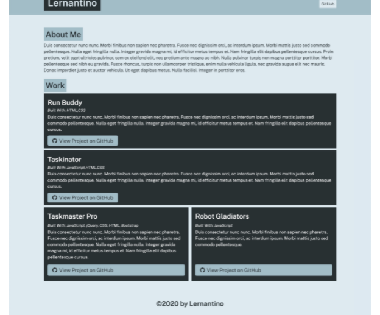

# portfolio-generator
Module 9 Coding Bootcamp Node.js

## Purpose
Use Node.js to build a program that creates an HTML portfolio page.
Use the command line to capture user input and place it in a JavaScript function that provides the finished HTML page as output.

## Built With
* Node.js
* npm
* Inquirer
* Git Hub

## Contribution
Made with ❤️ by Samantha Malone
Shout out to my tutor
© 2021 Samantha Malone. All rights reserved.
